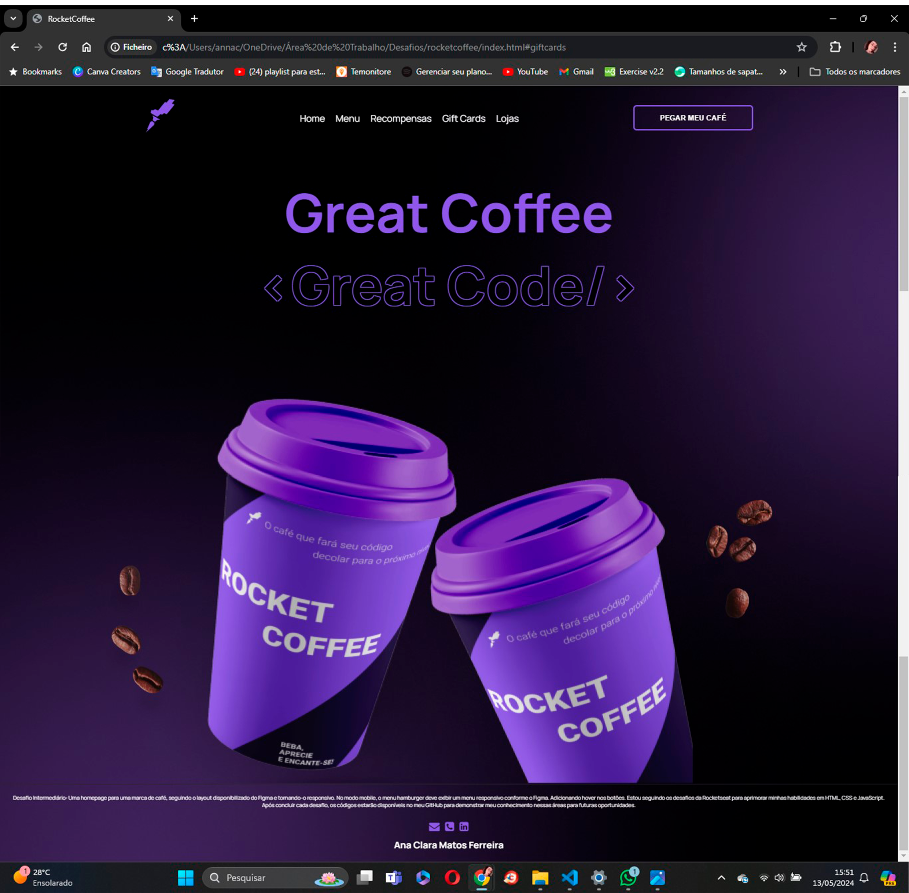

<h1 align="center"> Desafios Discover - RocketCoffee </h1>

Programa exclusivo e gratuito, promovido pela Rocketseat para ensino de tecnologias WEB.  
<a href="https://efficient-sloth-d85.notion.site/b0b109c64d0a4a8eb4de547de18fa04d?v=dd9d2f6b0f6542d69807f41312f4116d">Uma série de desafios do básicos ao avançado para que você possa praticar seus conhecimentos.</a>

  

## 🚀 Tecnologias

Esse projeto foi desenvolvido com as seguintes tecnologias:

- HTML
- CSS
- JavaScript
- Figma
- Git e Github

## 💻 Projeto

O desafio foi construir uma homepage para uma marca de café. 

**Requisitos para o desafio:**
- Seguir o layout do Figma.
- Deixar o layout responsivo conforme o Figma.
- Na versão mobile, ao clicar no menu hamburger deverá exibir um menu responsivo conforme layout do Figma.
- Adicionar `hover` nos botões.

## 📺 Responsive test
